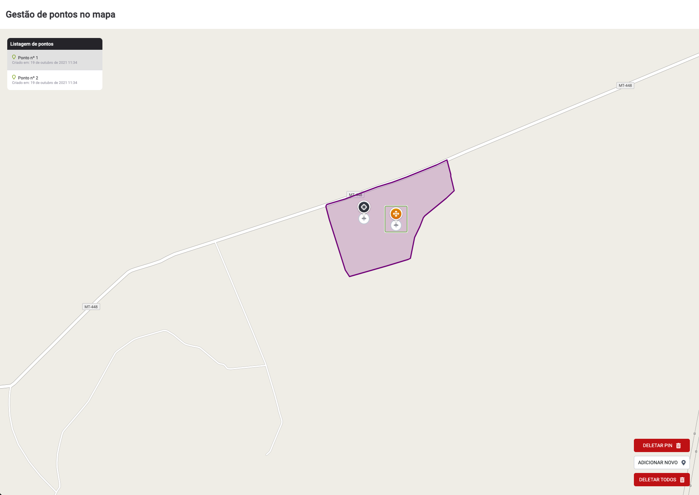

<p align="center">
  
</p>

<p align="center">
  
</p>

<h1 align="center">
    
</h1>

<br>

## 🧪 Tecnologias

Esse projeto foi desenvolvido com as seguintes tecnologias:

- [React](https://reactjs.org)
- [TypeScript](https://www.typescriptlang.org/)
- [React Leaflet](https://react-leaflet.js.org/)

## 🚀 Como executar

Clone o projeto e acesse a pasta do mesmo.

```bash
$ git clone https://github.com/taiuanpagini/checkplant.git
$ cd checkplant
```

Para iniciá-lo, siga os passos abaixo:
```bash
# Instalar as dependências
$ yarn
# Iniciar o projeto
$ yarn start
```
O app estará disponível no seu browser pelo endereço http://localhost:3000.

## 💻 Projeto

Checkplant é um projeto desenvolvido como parte de um teste, onde o usuário pode adicionar pontos de monitoramento, excluir ou editar os pontos.

---

Feito com 💜 by Taiuan Pagini 👋🏻